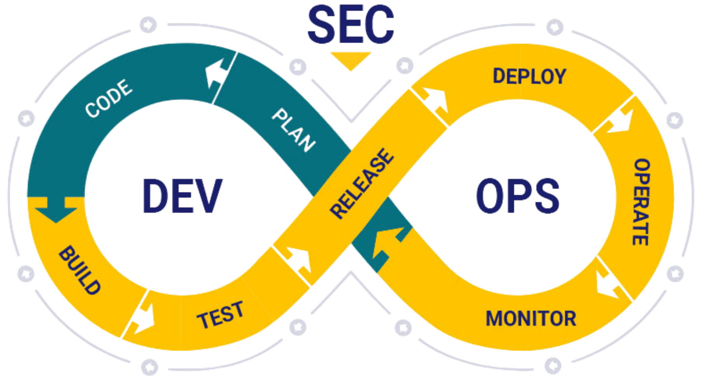
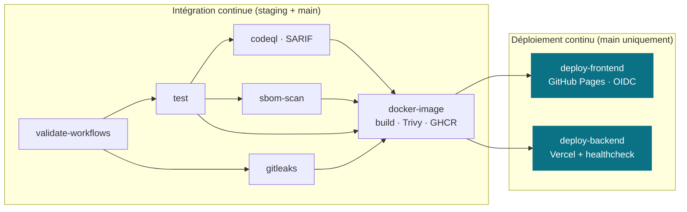
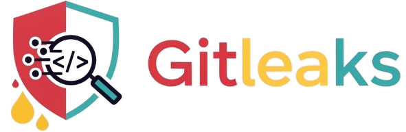
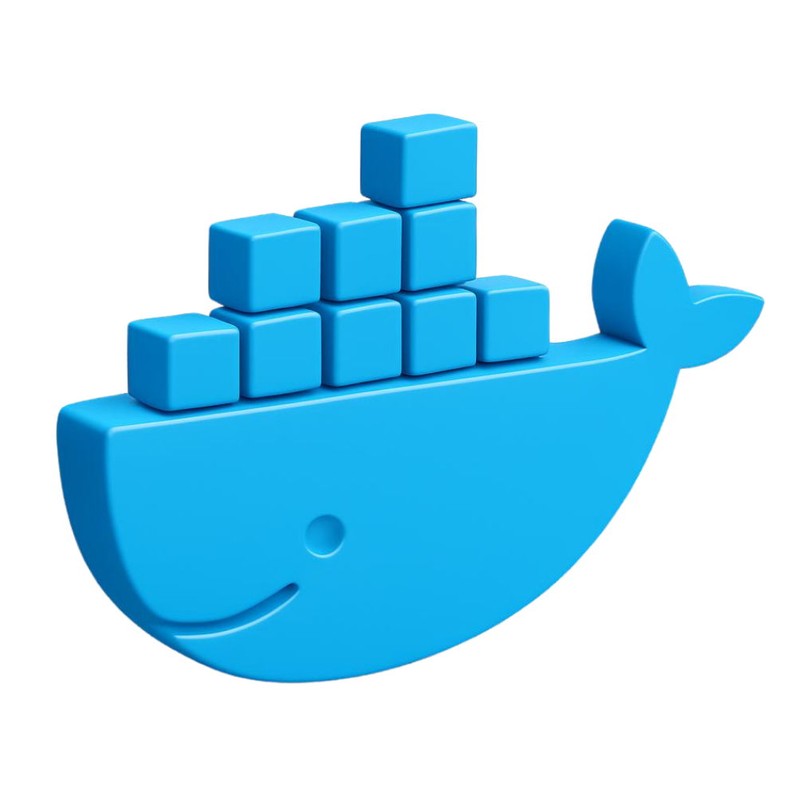

<div align="center">

<p>
  <picture>
    <source media="(prefers-color-scheme: dark)" srcset="docs/assets/logo_ynov_campus_sophia_white.png">
    
  </picture>
  &nbsp;&nbsp;&nbsp;&nbsp;
  
</p>

# 🛡️ SecureWallet

### Industrialisation, durcissement et architecture CI/CD

**Chaîne de livraison auditable, hermétique et infalsifiable.**
Une SPA statique et une API Node.js manipulant des données sensibles, industrialisées
en un pipeline durci où *aucun code n'atteint la production sans validation technique*.

[](https://github.com/Sorway/DevSecOps/actions/workflows/ci-cd.yml)
[](.github/workflows/ci-cd.yml)
[](.github/secrets-prod.yaml)
[](https://github.com/Sorway/DevSecOps/pkgs/container/devsecops%2Fbackend)
[](backend/Dockerfile)

🌐 **[Frontend (GitHub Pages)](https://sorway.github.io/DevSecOps/)**  ·  ⚙️ **[API (Vercel)](https://projet-final-inky-iota.vercel.app)**  ·  ❤️ **[Healthcheck `/api/health`](https://projet-final-inky-iota.vercel.app/api/health)**

</div>

---

> [!NOTE]
> **Projet final du module DevSecOps avancé, Sophia Ynov Campus (TD).**
> Une équipe de développement nous confie le dépôt d'une application : une SPA statique ([`frontend/`](frontend/))
> et une API Node.js / Express ([`backend/`](backend/)) manipulant des données hautement sensibles (clés d'API,
> accès à des infrastructures externes). Notre mission : **industrialiser, durcir et sécuriser toute la chaîne
> CI/CD** (gouvernance Git, secrets chiffrés, conteneurisation, analyse statique, déploiement continu) afin
> qu'*aucun code n'atteigne la production sans validation technique auditée*.

## 🧭 Aperçu

Le dépôt réunit deux composants distincts, industrialisés dans une **unique chaîne CI/CD durcie**.
La gouvernance Git interdit toute action non auditée : le code transite par une branche d'intégration,
la production n'accepte que du code *techniquement validé*, et chaque secret reste chiffré de bout en bout.

| Composant | Description | Livraison |
|-----------|-------------|-----------|
| [`frontend/`](frontend/) | Single Page Application 100 % statique (HTML / CSS / JS moderne) consommant l'API | **GitHub Pages** via OIDC |
| [`backend/`](backend/) | API REST Node.js / Express manipulant des données sensibles (clés d'API, infra externes) | **Docker → GHCR** + **Vercel** |

> Le frontend est aussi copié dans [`backend/public/`](backend/public/) pour que le backend reste
> autonome lors des builds Docker et des déploiements Vercel.

---

## ⭐ Points clés

| Domaine | Mise en œuvre |
|--------|----------------|
| 🔀 **Gouvernance** | `staging` pivot d'intégration · `main` protégée (revue + status checks requis, push direct interdit) |
| 🧱 **Shift-Left** | Hook `pre-commit` : `actionlint` + `gitleaks` (staged) + refus des fichiers `.env`/`.pem`/`.key` |
| 🔐 **Secrets** | Chiffrement par enveloppe **SOPS + age**, déchiffrés **en RAM** au runtime, jamais sur disque |
| 🐳 **Conteneur** | Dockerfile multi-stage, non-root, scan **Trivy**, publication conditionnelle sur **GHCR** taggée au SHA |
| 🧪 **CI hermétique** | Moindre privilège (`contents: read`), cache npm, **CodeQL** (SARIF), barrière stricte sans `continue-on-error` |
| 🧩 **Composite Action** | `trivy-scan` réutilisable : échec sur `CRITICAL`, avertissement sur `HIGH`/`MEDIUM` |
| 🚀 **CD** | Frontend Pages (OIDC, hermétique) · Backend Vercel (CLI, secrets injectés à la volée) |
| 🛟 **Robustesse** | Concurrence annulante · **Healthcheck** post-déploiement sur `/api/health` |

---

## 🧰 Stack technique

<div align="center">


</div>

---

## 🏗️ Architecture du pipeline

À la simple lecture de [`ci-cd.yml`](.github/workflows/ci-cd.yml), un auditeur constate qu'un déploiement
sur `main` **exige le succès absolu** des jobs de validation amont (chaînage `needs`). Les jobs de
déploiement sont conditionnés par `if: github.ref == 'refs/heads/main'`.



> ⛔ **Barrière absolue** : si Gitleaks lève une alerte, si CodeQL trouve une faille `High`/`Error`,
> ou si le scan d'image Docker échoue, le pipeline s'arrête et **bloque tout déploiement**.
> L'usage de `continue-on-error: true` est proscrit.

---

## 🔀 Gouvernance Git

| Branche | Rôle | Règles |
|---------|------|--------|
| `staging` | Branche **pivot** d'intégration | La CI s'exécute **entièrement** à chaque push et pull request |
| `main` | État **stable en production** | Push directs **interdits** · **revue** + status checks requis (ruleset) · environnement `production` |

La stratégie de promotion est **lisible directement dans le YAML** :

```yaml
on:
  push:
    branches: [staging, main]        # déclenché sur les deux branches
  pull_request:
    branches: [staging, main]

jobs:
  deploy-backend:
    if: github.ref == 'refs/heads/main'                       # bloc conditionnel de niveau job
    needs: [test, gitleaks, codeql, sbom-scan, docker-image]  # matrice de dépendance stricte
    environment: production                                   # environnement GitHub nommé
```

> 📋 La politique cible est documentée dans [`.github/branch-protection/main.yml`](.github/branch-protection/main.yml).

---

## 🔐 Sécurité et durcissement

### Shift-Left : hook `pre-commit`
Avant qu'une ligne n'atteigne GitHub, [`scripts/pre-commit.sh`](scripts/pre-commit.sh) valide **séquentiellement** :
1. **`actionlint`** sur `.github/workflows/`, *bloque* en cas d'erreur.
2. **`gitleaks`** sur les modifications *indexées uniquement*, *bloque* si un secret est trouvé.
3. **Contrôle de structure** : tout `.env` / `.pem` / `.key` indexé avorte le commit en rouge :
   > *Sécurité : Tentative de commit d'un fichier de configuration ou d'une clé en clair. Opération annulée.*

```bash
git config core.hooksPath scripts/hooks   # ou :
bash scripts/install-hooks.sh             # installe le hook dans .git/hooks/
```

### Règle Gitleaks sur-mesure (`gitleaks.toml`)



Interception des jetons internes : préfixe `SECWALLET_` + **24 caractères alphanumériques majuscules**, avec entropie.

```toml
[[rules]]
id = "secwallet-internal-token"
regex   = '''SECWALLET_[A-Z0-9]{24}'''
entropy = 3.5
keywords = ["SECWALLET_"]
```

### Secrets par enveloppe (SOPS / age)
- Clé privée **age** nommée `ops.txt` (ignorée par Git). Clé publique = destinataire du chiffrement.
- [`.github/secrets-prod.yaml`](.github/secrets-prod.yaml) : chiffrement **sélectif**, seules les *valeurs*
  deviennent des blocs `ENC[...]`, les *clés* YAML restent lisibles pour des `git diff` propres.
- En CD, `SOPS_AGE_KEY` déchiffre le fichier **en mémoire RAM**, **aucun secret n'est écrit sur le disque du runner**.

### SAST et scan d'images

&nbsp;&nbsp;&nbsp;

- **CodeQL** (`security-extended`) analyse le JavaScript, téléverse le **SARIF**, et **échoue** sur `error` ou `security-severity ≥ 7.0`.
- **Trivy** scanne le SBOM (composite action) et l'image Docker (`HIGH`/`CRITICAL`) avant toute publication.

---

## 🚀 Déploiement continu

Le déploiement ne se déclenche **que si toute la CI est verte** et **uniquement sur `main`**.

### Frontend → GitHub Pages
`upload-pages-artifact` empaquette `/frontend`, `deploy-pages` publie via **OIDC** (`pages: write` + `id-token: write`),
sans laisser de trace de build dans l'historique Git.
→ **https://sorway.github.io/DevSecOps/**

### Backend → Vercel

&nbsp;&nbsp;&nbsp;

`deploy-backend` (dépendant de tous les jobs sécurité + livraison) déchiffre les secrets **en RAM** et les injecte
à la volée (`--env`) dans `vercel deploy`. Un **healthcheck** `curl --fail .../api/health` fait échouer le job si l'API ne répond pas `200`.
→ **https://projet-final-inky-iota.vercel.app**

---

## 🗂️ Structure du dépôt

```text
.
├── frontend/                       # SPA statique → GitHub Pages
├── backend/
│   ├── src/app.js                  # API Express (routes /api/*)
│   ├── public/                     # copie du frontend (autonomie build/déploiement)
│   ├── tests/                      # unit · integration · e2e (Jest + supertest)
│   ├── Dockerfile                  # build multi-stage non-root
│   └── vercel.json
├── .github/
│   ├── workflows/ci-cd.yml         # pipeline principal durci (staging + main)
│   ├── actions/trivy-scan/         # composite action, scan SBOM CycloneDX
│   ├── branch-protection/main.yml  # politique de protection documentée
│   └── secrets-prod.yaml           # secrets chiffrés SOPS (valeurs ENC[...])
├── scripts/
│   ├── pre-commit.sh               # hook Shift-Left versionné
│   ├── install-hooks.sh / .ps1     # installation du hook
│   └── frontend-smoke-test.js      # test de fumée du frontend
├── docs/assets/                    # logos (Ynov Campus, DevSecOps)
├── gitleaks.toml                   # règle SECWALLET_ sur-mesure
└── README.md
```

---

## 💻 Démarrage local

```bash
npm install                         # workspace (backend inclus)
npm test                            # tests Jest du backend + smoke-test frontend
npm run lint                        # node --check + lint backend
git config core.hooksPath scripts/hooks   # active la barrière Shift-Left
```

---

## 👥 Équipe

<div align="center">
<table>
  <tr>
    <td align="center">
      <a href="https://github.com/Sorway">
        <br/>
        <sub><b>Sorway</b></sub>
      </a>
    </td>
    <td align="center">
      <a href="https://github.com/astronas">
        <br/>
        <sub><b>Thibaut Gianola</b></sub>
      </a>
    </td>
    <td align="center">
      <a href="https://github.com/Tiwen2">
        <br/>
        <sub><b>Tiwen2</b></sub>
      </a>
    </td>
  </tr>
</table>
</div>

---

## 📄 Licence

Projet académique réalisé dans le cadre du cours **DevSecOps avancé, Sophia Ynov Campus**.
Usage éducatif. © 2026, équipe SecureWallet.

<div align="center">

*Industrialisation · Durcissement · Architecture CI/CD*

</div>
