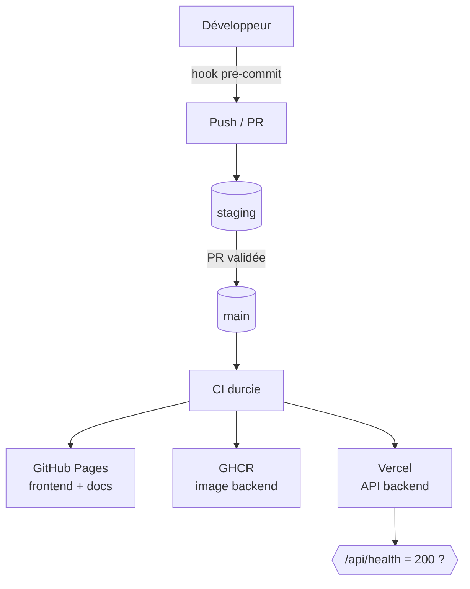

# Architecture du dépôt

Deux composants distincts dans un même dépôt, industrialisés par une **unique chaîne CI/CD durcie**.

## Arborescence

```text
.
├── frontend/                       # SPA statique → GitHub Pages
├── backend/
│   ├── src/app.js                  # API Express (routes /api/*)
│   ├── public/                     # copie du frontend (autonomie build/déploiement)
│   ├── tests/                      # unit · integration · e2e (Jest + supertest)
│   ├── Dockerfile                  # build multi-stage non-root (node:24-alpine)
│   └── vercel.json
├── .github/
│   ├── workflows/ci-cd.yml         # pipeline principal durci (staging + main)
│   ├── actions/trivy-scan/         # composite action : scan SBOM CycloneDX
│   ├── branch-protection/main.yml  # politique de protection documentée
│   └── secrets-prod.yaml           # secrets chiffrés SOPS (valeurs ENC[...])
├── scripts/
│   ├── pre-commit.sh               # hook Shift-Left versionné
│   ├── install-hooks.sh / .ps1     # installation du hook
│   └── frontend-smoke-test.js
├── documentation/                  # ce site (Zensical) → publié sur /docs/
├── gitleaks.toml                   # règle SECWALLET_ sur-mesure
└── README.md
```

## Les deux composants

| Composant | Rôle | Techno | Livraison |
|-----------|------|--------|-----------|
| **Frontend** | SPA statique consommant l'API | HTML / CSS / JS moderne | GitHub Pages (OIDC) |
| **Backend** | API REST, données sensibles | Node.js 24 / Express | Docker → GHCR + Vercel |

!!! info "Frontend embarqué dans le backend"
    Le frontend est aussi copié dans `backend/public/` afin que le backend reste **autonome** lors
    des builds Docker et des déploiements Vercel (il sert sa propre copie statique).

## Flux de bout en bout



Chaque niveau ajoute une garantie : le **hook local** (Shift-Left), la **CI** (barrière stricte),
la **protection de branche** (revue avant `main`) et le **healthcheck** (validation post-déploiement).
