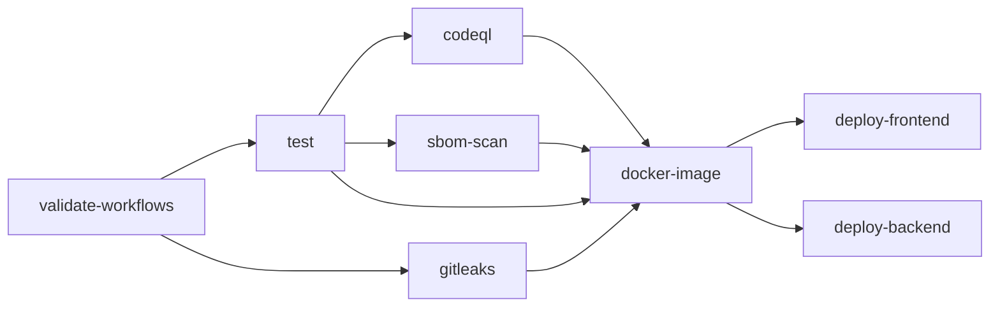

# Pipeline CI durci

Le workflow [`ci-cd.yml`](https://github.com/Sorway/DevSecOps/blob/main/.github/workflows/ci-cd.yml)
agit comme une **barrière** : rien ne se déploie sans le succès complet des contrôles.

## Moindre privilège

```yaml
permissions:
  contents: read        # ← global : lecture seule par défaut
```

Aucun job n'hérite de droits d'écriture. Les privilèges nécessaires sont **isolés** au job concerné :

| Job | Privilège isolé |
|-----|-----------------|
| `docker-image` | `packages: write` (push GHCR) |
| `codeql` | `security-events: write` (upload SARIF) |
| `deploy-frontend` | `pages: write` + `id-token: write` (OIDC) |

## Optimisation

Mise en cache des dépendances Node via `actions/setup-node` sur les deux lockfiles :

```yaml
- uses: actions/setup-node@v5
  with:
    node-version: 24
    cache: npm
    cache-dependency-path: |
      package-lock.json
      backend/package-lock.json
```

## Barrière d'interruption stricte

| Contrôle | Comportement bloquant |
|----------|----------------------|
| **Tests** | `npm test` (Jest backend + smoke-test frontend) doit réussir |
| **Gitleaks** | code de sortie ≠ 0 si un secret est découvert (`gitleaks-action`) |
| **CodeQL** | échec sur `error` ou `security-severity ≥ 7.0` |
| **Scan image Docker** | échec sur toute vulnérabilité `HIGH`/`CRITICAL` |

!!! danger "`continue-on-error: true` est interdit"
    Aucune étape n'échappe à la barrière. Si Gitleaks lève une alerte, si CodeQL trouve une faille,
    ou si le scan d'image échoue, le pipeline **s'arrête** et bloque immédiatement toute la suite.

## Graphe des dépendances



Transitivement, les déploiements (`deploy-frontend`, `deploy-backend`) exigent le succès de
**l'intégralité** des jobs de validation.
