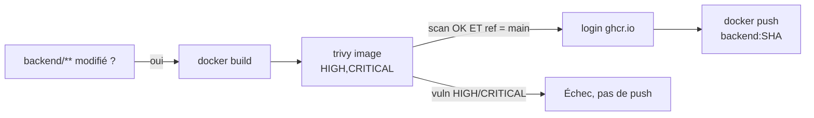

# Conteneurisation & GHCR

L'artefact serveur du backend est construit et publié en image Docker **sécurisée**.

{ height="32" }

## Dockerfile multi-stage non-root

```dockerfile
# syntax=docker/dockerfile:1.7
FROM node:24-alpine AS deps
WORKDIR /app
COPY package*.json ./
RUN npm ci --omit=dev

FROM node:24-alpine AS runtime
ENV NODE_ENV=production
WORKDIR /app
RUN apk upgrade --no-cache \
  && rm -rf /usr/local/lib/node_modules/npm /usr/local/bin/npm /usr/local/bin/npx /usr/local/bin/corepack \
  && addgroup -S nodeapp && adduser -S nodeapp -G nodeapp
COPY --from=deps /app/node_modules ./node_modules
COPY src ./src
COPY public ./public
USER nodeapp
EXPOSE 3000
CMD ["node", "src/app.js"]
```

Bonnes pratiques appliquées :

- [x] **Multi-stage** : les dépendances sont installées dans `deps`, seul le nécessaire passe en `runtime`.
- [x] **Image minimale** : base Alpine, `npm ci --omit=dev`, npm/npx retirés de l'image finale.
- [x] **Non-root** : exécution sous l'utilisateur dédié `nodeapp`.
- [x] **`apk upgrade`** pour appliquer les correctifs de la base.

## Filtrage de chemins

L'image n'est (re)construite **que si les fichiers concernés changent**, via `dorny/paths-filter` :

```yaml
- uses: dorny/paths-filter@v4
  id: filter
  with:
    filters: |
      backend:
        - 'backend/**'
        - '.github/workflows/ci-cd.yml'
```

Chaque étape de build/scan/push est ensuite conditionnée par `if: steps.filter.outputs.backend == 'true'`.

## Scan puis publication conditionnelle sur GHCR



L'image n'est poussée sur **GHCR** que si **le scan réussit** et **sur `main`**, taggée au **SHA** du commit :

```yaml
- id: meta
  run: echo "image=ghcr.io/${GITHUB_REPOSITORY,,}/backend:${GITHUB_SHA}" >> "$GITHUB_OUTPUT"
- uses: docker/login-action@v4
  if: github.ref == 'refs/heads/main' && steps.filter.outputs.backend == 'true'
  with: { registry: ghcr.io, username: ${{ github.actor }}, password: ${{ secrets.GITHUB_TOKEN }} }
```

Le privilège `packages: write` est **isolé** à ce job (voir [Pipeline CI durci](ci.md)).
