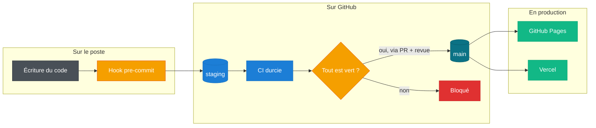
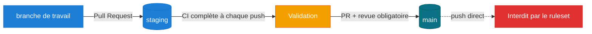
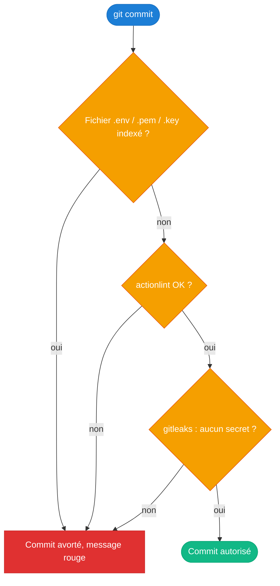
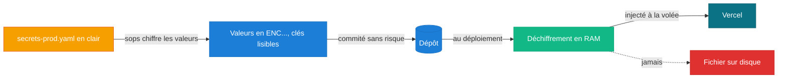
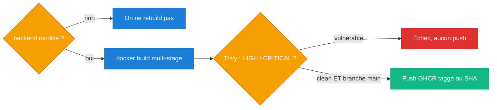
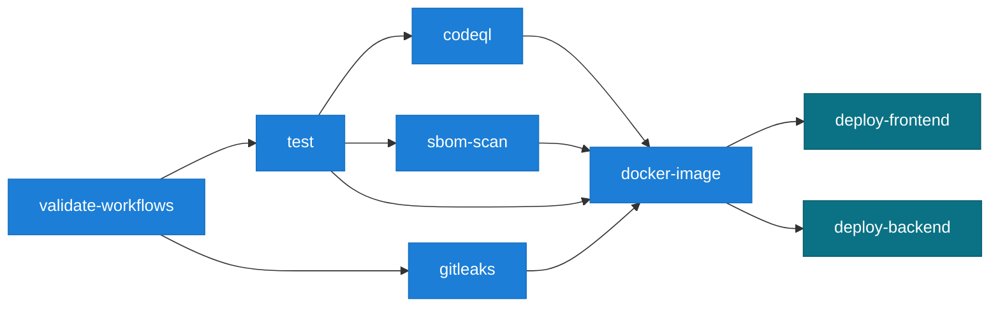
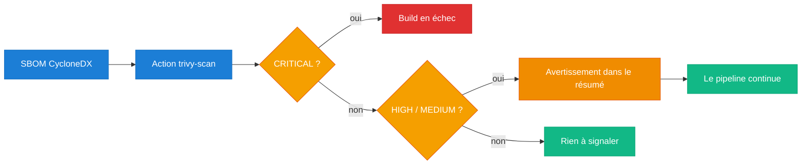
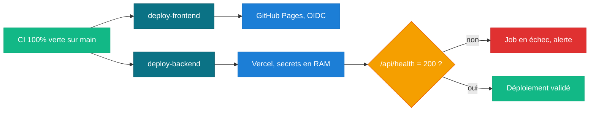
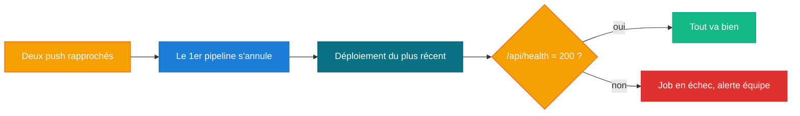

# Contexte & consignes

## Le point de départ

On nous confie un dépôt qui contient déjà l'application. Notre travail n'est donc pas d'écrire le
code métier, mais de **l'industrialiser** : bâtir autour de lui une chaîne d'intégration et de
déploiement qui rende chaque action tracée, vérifiée et reproductible. En clair, faire passer un
projet du stade « ça marche sur ma machine » à celui d'une usine logicielle auditable.

L'application a deux visages : un **frontend** (une SPA statique qui consomme l'API) et un
**backend** (une API Node.js / Express qui manipule des données sensibles, avec des clés d'API et
des accès à des infrastructures externes). Ce sont deux mondes très différents à livrer, donc on les
traite séparément dans une même chaîne.

Tout le projet tient dans une phrase, qu'on a gardée en tête à chaque décision :

> **Aucun code n'atteint la production sans avoir été techniquement validé.**

Chaque étage ci-dessus est une **garantie** ajoutée. On les détaille maintenant, thème par thème.
Pour chacun : ce qu'on nous demande, puis notre démarche (le besoin, ce qu'on a vu en cours, les
contraintes de l'énoncé, ce qu'on met en place, et ce qu'on ne doit pas oublier).

## 1. La gouvernance des branches

**Ce qu'on nous demande.** Deux branches aux rôles clairs (`staging` pour l'intégration, `main` pour
la production intouchable), avec une politique **lisible directement dans le YAML**.

**Notre démarche.**

- **Prise en compte du besoin.** Éviter qu'une personne modifie la production sans contrôle, tout en
  donnant à l'équipe une base commune où se synchroniser sans conflit.
- **Vu en cours et bonnes pratiques.** Un flux Git à branche protégée : une branche d'intégration, une
  branche de production verrouillée, et *tout passe par une Pull Request revue* (revue par les pairs).
- **Contraintes de l'énoncé.** Déclenchement sur `staging` **et** `main`, blocs `if` sur `main`,
  matrice `needs` stricte, et job de production lié à un `environment` nommé.
- **Ce qu'on met en place.** `staging` en branche par défaut, un ruleset GitHub qui exige une revue
  sur `main`, et une politique rendue visible dans le workflow lui-même.
- **À ne pas oublier.** Le push direct sur `main` est **interdit** (pas déconseillé), la politique
  doit être **visible dans le YAML**, et le job de prod porte un `environment` nommé.

## 2. Le durcissement local (Shift-Left)

**Ce qu'on nous demande.** Un hook `pre-commit` qui, sur le poste, valide les workflows avec
`actionlint`, scanne les fichiers indexés avec `gitleaks`, et refuse tout fichier `.env`, `.pem`
ou `.key`.

**Notre démarche.**

- **Prise en compte du besoin.** Une erreur attrapée sur le poste coûte bien moins cher qu'une erreur
  découverte en production ; on veut donc filtrer au plus tôt.
- **Vu en cours et bonnes pratiques.** Le principe **Shift-Left** : déplacer les contrôles de sécurité
  vers le début de la chaîne. Les hooks Git `pre-commit` sont l'outil standard pour ça.
- **Contraintes de l'énoncé.** Validation séquentielle `actionlint` + `gitleaks` **sur les fichiers
  indexés uniquement**, refus `.env`/`.pem`/`.key` avec message rouge, et règle `SECWALLET_` sur-mesure.
- **Ce qu'on met en place.** Un hook versionné (auditable et réinstallable), trois barrières
  bloquantes, et une règle Gitleaks `SECWALLET_[A-Z0-9]{24}` avec entropie.
- **À ne pas oublier.** Le message rouge est imposé **au mot près**, gitleaks ne scanne que le
  **staged**, la règle veut **exactement 24 caractères**, et le hook doit **réellement bloquer**.

## 3. Les secrets par enveloppe

**Ce qu'on nous demande.** Aucun secret de production en clair dans le dépôt, mais un fichier dont la
**structure reste lisible** pour l'équipe Ops.

**Notre démarche.**

- **Prise en compte du besoin.** Stocker des secrets de prod dans un dépôt Git sans jamais les
  exposer, tout en gardant un fichier qu'on peut relire et auditer.
- **Vu en cours et bonnes pratiques.** Le **chiffrement par enveloppe** et la philosophie **GitOps** :
  les secrets vivent chiffrés dans le dépôt et ne sont déchiffrés qu'au runtime, avec `age` (moderne)
  et **SOPS**.
- **Contraintes de l'énoncé.** Clé privée nommée `ops.txt`, chiffrement **des seules valeurs** (clés
  YAML lisibles), et déchiffrement en RAM sans jamais écrire de secret sur le disque du runner.
- **Ce qu'on met en place.** Une paire `age`, un `encrypted_regex` qui ne chiffre que les valeurs, et
  `SOPS_AGE_KEY` lu directement en mémoire au déploiement.
- **À ne pas oublier.** `ops.txt` reste hors du dépôt, **seules les valeurs** sont chiffrées, et
  **aucun fichier de secret en clair** ne touche le disque (donc pas de `mktemp`).

## 4. La conteneurisation et GHCR

**Ce qu'on nous demande.** Emballer le backend dans une image Docker propre, ne la reconstruire que
si nécessaire, la scanner avant publication, et ne la pousser sur GHCR que si le scan est clean.

**Notre démarche.**

- **Prise en compte du besoin.** Livrer le backend sous une forme reproductible et sûre, sans
  gaspiller de temps à reconstruire l'image quand rien n'a changé.
- **Vu en cours et bonnes pratiques.** Le `Dockerfile` **multi-stage** (image finale minimale),
  l'exécution **non-root**, le scan de vulnérabilités **avant** publication, et un tag **immuable**
  (le SHA) plutôt que `latest`.
- **Contraintes de l'énoncé.** Multi-stage, build conditionné au **filtrage de chemins**, scan Trivy
  avant publication, et push GHCR seulement si le scan réussit, taggé au SHA du commit.
- **Ce qu'on met en place.** Deux étages `deps` / `runtime`, un utilisateur `nodeapp`, un filtre
  `dorny/paths-filter`, `trivy image`, et un push conditionnel.
- **À ne pas oublier.** Multi-stage **et** non-root, rebuild **seulement si** concerné, scan **avant**
  le push, et tag **= SHA** (pas `latest`).

## 5. La CI durcie, une vraie barrière

**Ce qu'on nous demande.** Un pipeline en **moindre privilège**, avec cache, **CodeQL**, et qui se
comporte en **barrière** : tests, Gitleaks et scan d'image bloquants, `continue-on-error` interdit.

**Notre démarche.**

- **Prise en compte du besoin.** Que le pipeline soit une vraie barrière qu'on ne peut pas contourner,
  et non une simple formalité qui laisse passer un problème.
- **Vu en cours et bonnes pratiques.** Le **moindre privilège** sur les jetons, l'analyse statique
  (**SAST**) avec CodeQL, le principe **fail-fast**, et l'interdiction de tout contournement.
- **Contraintes de l'énoncé.** `permissions: contents: read` global, cache Node, CodeQL + SARIF avec
  échec sur `High`/`Error`, tests et Gitleaks bloquants, `continue-on-error` interdit, CD dépendante.
- **Ce qu'on met en place.** Des permissions globales en lecture seule, des écritures isolées par job,
  un contrôle `jq` sur le rapport SARIF, et un graphe `needs` strict.
- **À ne pas oublier.** `contents: read` **global**, écritures **isolées**, `continue-on-error`
  **interdit**, CodeQL doit **faire échouer** sur une faille majeure, et le **SARIF est téléversé**.

## 6. La composite action

**Ce qu'on nous demande.** Isoler le scan de dépendances (SBOM) dans une **action composite**
réutilisable, avec une entrée obligatoire, qui échoue seulement sur `CRITICAL`.

**Notre démarche.**

- **Prise en compte du besoin.** Éviter de copier-coller la même logique de scan dans plusieurs
  workflows, et la partager comme un composant autonome.
- **Vu en cours et bonnes pratiques.** Factoriser la logique répétée (principe **DRY**) et exposer
  une **boîte noire** qui masque sa complexité derrière des entrées / sorties claires.
- **Contraintes de l'énoncé.** Type `composite`, entrée obligatoire (le chemin du SBOM CycloneDX),
  échec **uniquement** sur `CRITICAL`, et simple **avertissement** pour `HIGH` et `MEDIUM`.
- **Ce qu'on met en place.** Un `action.yml` composite, une entrée requise, l'installation de Trivy
  intégrée, et deux niveaux de sévérité.
- **À ne pas oublier.** Type **composite** avec entrée **obligatoire**, échec **seulement CRITICAL**,
  `HIGH`/`MEDIUM` en **avertissement**, et l'action **installe Trivy elle-même**.

## 7. Le déploiement continu

**Ce qu'on nous demande.** Ne déployer que si toute la CI est verte, et seulement sur `main` :
frontend sur **GitHub Pages** via OIDC, backend sur **Vercel** en ligne de commande.

**Notre démarche.**

- **Prise en compte du besoin.** Automatiser la mise en production, mais uniquement quand tout est
  validé, et sans jamais exposer un secret au passage.
- **Vu en cours et bonnes pratiques.** L'**OIDC** (identité fédérée, sans secret longue durée) pour
  Pages, le déploiement **hermétique** (artefact éphémère), et l'injection des secrets **à la volée**.
- **Contraintes de l'énoncé.** Déploiement `main` uniquement et CI verte, frontend en OIDC
  (`pages: write` + `id-token: write`), backend Vercel avec secrets déchiffrés en RAM.
- **Ce qu'on met en place.** Deux jobs conditionnés à `main` et dépendants de tout, `upload-pages` +
  `deploy-pages`, et `vercel deploy` avec les variables passées en `--env`.
- **À ne pas oublier.** `main` **uniquement** et CI **verte**, **OIDC** (`pages` + `id-token`), et
  secrets **injectés à la volée** sans rien écrire sur le disque.

## 8. La robustesse

**Ce qu'on nous demande.** Annuler le pipeline d'un commit dépassé par un plus récent, et vérifier
après déploiement que l'API répond bien (sinon, échouer).

**Notre démarche.**

- **Prise en compte du besoin.** Ne pas gaspiller de ressources sur un commit déjà remplacé, et ne
  jamais laisser une version cassée en ligne sans le savoir.
- **Vu en cours et bonnes pratiques.** L'**annulation de concurrence** (on stoppe les exécutions
  périmées) et le **healthcheck** (smoke test) juste après le déploiement.
- **Contraintes de l'énoncé.** Le pipeline du premier de deux commits rapprochés doit s'annuler, et
  un `curl` sur `/api/health` doit faire échouer le job si la réponse n'est pas `200`.
- **Ce qu'on met en place.** Une `concurrency` avec `cancel-in-progress`, et un `curl --fail` sur
  l'URL de production générée dynamiquement.
- **À ne pas oublier.** Annulation **immédiate** du run périmé, healthcheck sur l'**URL dynamique**,
  et tout code **différent de 200** fait **échouer** le job.

Chaque exigence est reprise, **avec sa preuve** (extrait de code, configuration, déploiement en
ligne), sur la page [Conformité](conformite.md). Le détail technique complet se trouve dans la section
[Implémentation](architecture.md).
