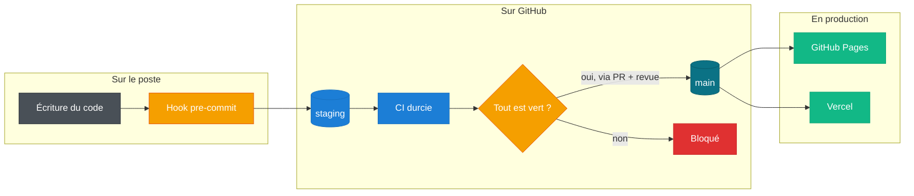
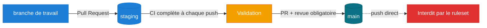
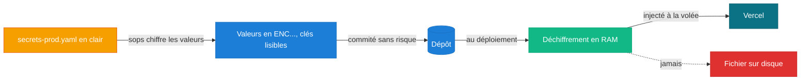
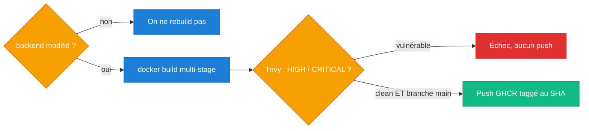
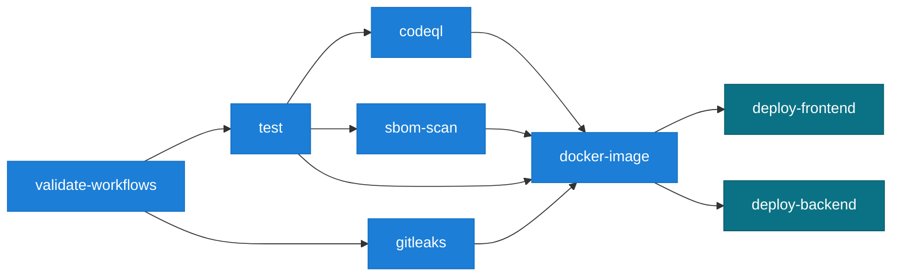
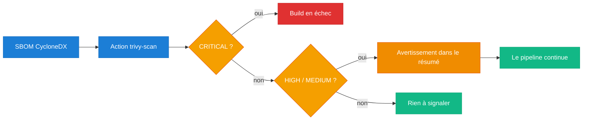
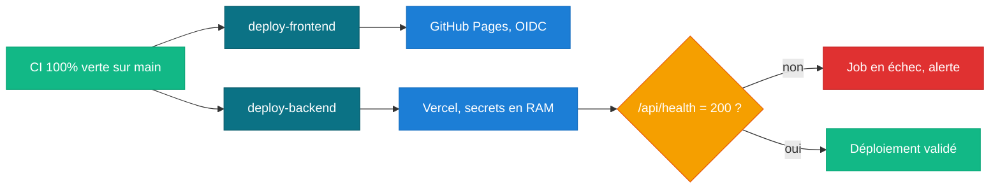
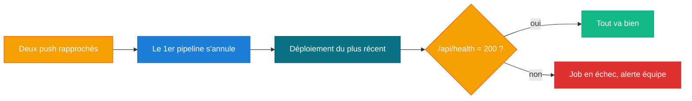

# Contexte & consignes

## Le point de départ

On nous confie un dépôt qui contient déjà l'application. Notre travail n'est donc pas d'écrire le
code métier, mais de **l'industrialiser** : bâtir autour de lui une chaîne d'intégration et de
déploiement qui rende chaque action tracée, vérifiée et reproductible. En clair, faire passer un
projet du stade « ça marche sur ma machine » à celui d'une usine logicielle auditable.

L'application a deux visages : un **frontend** (une SPA statique qui consomme l'API) et un
**backend** (une API Node.js / Express qui manipule des données sensibles, avec des clés d'API et
des accès à des infrastructures externes). Ce sont deux mondes très différents à livrer, donc on les
traite séparément dans une même chaîne.

Tout le projet tient dans une phrase, qu'on a gardée en tête à chaque décision :

> **Aucun code n'atteint la production sans avoir été techniquement validé.**

Chaque étage ci-dessus est une **garantie** ajoutée. On les détaille maintenant, thème par thème :
pour chacun, ce qu'on nous demande, comment on s'y prend, et surtout ce qu'on ne doit pas oublier.

## 1. La gouvernance des branches

**Ce qu'on nous demande.** Deux branches avec des rôles clairs : `staging` sert de point de
rencontre pour tout le monde (la CI y tourne à chaque événement), et `main` représente la production,
sur laquelle personne ne pousse directement. La politique doit être **lisible dans le YAML** lui-même.

**Comment on s'y prend.** On a fait de `staging` la branche par défaut du dépôt, pour que tout parte
naturellement d'elle. `main` est verrouillée par un ruleset GitHub qui **exige une revue** avant
toute fusion. Et surtout, on a rendu la règle visible directement dans le workflow : il se déclenche
sur les deux branches, les jobs de déploiement portent un `if` sur `main`, une chaîne `needs` stricte,
et un `environment` nommé.

**À ne pas oublier.**

- Le push direct sur `main` est **strictement interdit** (pas seulement déconseillé).
- La politique doit être **visible dans le YAML**, pas uniquement documentée à côté.
- Le job de production doit être lié à un **`environment` nommé** (`production` / `github-pages`).

## 2. Le durcissement local (Shift-Left)

**Ce qu'on nous demande.** Attraper les erreurs **avant** qu'elles n'arrivent sur GitHub, grâce à un
hook `pre-commit` : valider les workflows avec `actionlint`, scanner les fichiers indexés avec
`gitleaks`, et refuser tout fichier `.env`, `.pem` ou `.key` avec un message d'erreur rouge.

**Comment on s'y prend.** L'idée du « Shift-Left », c'est de déplacer la sécurité le plus tôt
possible, sur le poste du développeur. On a versionné le hook (pour qu'il soit auditable et
réinstallable) et on l'a construit comme trois barrières successives : si l'une échoue, le commit
s'arrête net. On a aussi écrit une règle Gitleaks sur-mesure pour les jetons internes de l'entreprise.

**À ne pas oublier.**

- Le message d'erreur rouge est imposé **au mot près** : « Sécurité : Tentative de commit d'un
  fichier de configuration ou d'une clé en clair. Opération annulée. »
- Gitleaks ne scanne **que les fichiers indexés** (`--staged`), pas tout le dépôt.
- La règle `SECWALLET_` veut **exactement 24 caractères** majuscules, avec vérification d'**entropie**.
- Le hook doit **réellement bloquer** (code de sortie non nul), pas juste afficher un avertissement.

## 3. Les secrets par enveloppe

**Ce qu'on nous demande.** Aucun secret de production en clair dans le dépôt, mais un fichier dont la
**structure reste lisible** pour l'équipe Ops. On génère une paire de clés `age`, on chiffre les
valeurs avec **SOPS**, et on ne déchiffre qu'au moment du déploiement, sans jamais écrire de secret
sur le disque.

**Comment on s'y prend.** On a trouvé l'idée de l'enveloppe élégante : on chiffre **seulement les
valeurs**, pas les noms de champs. Résultat, un reviewer voit la structure du fichier évoluer dans les
`git diff` sans jamais voir un secret. Au runtime, la clé privée reste dans une variable
d'environnement et SOPS déchiffre directement en mémoire.

**À ne pas oublier.**

- La clé privée `age` doit s'appeler **`ops.txt`** (et rester hors du dépôt).
- **Seules les valeurs** sont chiffrées : les clés YAML restent lisibles (via `encrypted_regex`).
- **Aucun fichier de secret en clair** ne doit toucher le disque du runner (donc pas de `mktemp`).

## 4. La conteneurisation et GHCR

**Ce qu'on nous demande.** Emballer le backend dans une image Docker propre (multi-stage), ne la
reconstruire que si le code concerné change, la scanner avant publication, et ne la pousser sur GHCR
que si le scan est clean, taggée au SHA du commit.

**Comment on s'y prend.** On a séparé la construction en deux étages : un étage installe les
dépendances, l'autre ne garde que le strict nécessaire et tourne sous un utilisateur non-root. Un
filtre de chemins évite de reconstruire l'image pour rien. Et on a placé le scan Trivy **avant** le
push : tant qu'il reste une vulnérabilité haute ou critique, rien ne part sur le registre.

**À ne pas oublier.**

- Image **multi-stage** et exécution **non-root** (bonnes pratiques imposées).
- Ne (re)builder **que si** les fichiers concernés changent (filtrage de chemins).
- Le scan Trivy passe **avant** la publication ; le push n'a lieu que si le scan est clean **et** sur `main`.
- L'image est taggée au **SHA du commit**, pas juste `latest`.

## 5. La CI durcie, une vraie barrière

**Ce qu'on nous demande.** Un pipeline qui applique le moindre privilège (`contents: read` global),
met en cache les dépendances, analyse le code avec **CodeQL**, et surtout se comporte en **barrière** :
tests, Gitleaks et scan d'image doivent réussir, `continue-on-error` est interdit, et le déploiement
dépend de tout ça.

**Comment on s'y prend.** On a raisonné en « droits par défaut minimaux » : le workflow ne peut que
lire, et on ouvre les droits d'écriture (comme `packages: write`) uniquement dans le job qui en a
besoin. Ensuite, chaque contrôle est bloquant : le graphe de dépendances `needs` fait que si un seul
maillon casse, les déploiements ne démarrent même pas.

**À ne pas oublier.**

- `permissions: contents: read` au niveau **global** ; toute écriture est **isolée** au job concerné.
- **`continue-on-error: true` est interdit** partout.
- CodeQL doit **faire échouer** le job sur une vulnérabilité `High`/`Error`, et **téléverser le SARIF**.
- Les tests et Gitleaks sont **bloquants** ; la CD **dépend** de tous ces contrôles.

## 6. La composite action

**Ce qu'on nous demande.** Sortir le scan de dépendances (au format SBOM) dans une **action composite**
réutilisable, avec une entrée obligatoire (le chemin du SBOM), qui échoue uniquement sur des
vulnérabilités `CRITICAL` et se contente d'un avertissement pour les `HIGH` et `MEDIUM`.

**Comment on s'y prend.** On voulait une vraie « boîte noire » : l'action installe Trivy elle-même,
donc elle fonctionne toute seule, sans que le workflow appelant ait à s'en occuper. On a choisi deux
niveaux de sévérité pour ne pas bloquer inutilement sur des vulnérabilités moins graves, tout en
gardant une trace visible dans le résumé du workflow.

**À ne pas oublier.**

- Elle doit être de **type `composite`**, avec une **entrée obligatoire** (le chemin du SBOM CycloneDX).
- Échec **uniquement** sur `CRITICAL` ; `HIGH` et `MEDIUM` ne font qu'un **avertissement** (résumé).
- Pour être une vraie boîte noire, elle **installe Trivy elle-même**.

## 7. Le déploiement continu

**Ce qu'on nous demande.** Ne déployer que si toute la CI est verte, et seulement sur `main`. Le
frontend part sur **GitHub Pages** via OIDC, le backend sur **Vercel** en ligne de commande, avec les
secrets déchiffrés en RAM.

**Comment on s'y prend.** On a deux jobs de déploiement conditionnés à `main`, chacun dépendant de
tous les contrôles. Le frontend est publié de façon hermétique (artefact éphémère, aucune trace de
build dans l'historique Git), et le backend reçoit ses variables directement dans la commande de
déploiement. On en a profité pour publier cette documentation dans le même artefact, sous `/docs/`.

**À ne pas oublier.**

- Déploiement **uniquement sur `main`** et **seulement si toute la CI est verte**.
- Frontend en **OIDC** : permissions `pages: write` **et** `id-token: write`, publication hermétique.
- Backend Vercel : secrets **injectés à la volée**, rien n'est écrit en clair sur le runner.

## 8. La robustesse

**Ce qu'on nous demande.** Prouver que l'infrastructure tient la charge : annuler le pipeline d'un
commit dépassé par un plus récent, et vérifier après déploiement que l'API répond bien (sinon, échouer).

**Comment on s'y prend.** On a activé l'annulation de concurrence pour ne pas gaspiller de ressources
ni risquer deux déploiements en parallèle. Et on termine la chaîne par un `curl` sur `/api/health` :
c'est notre filet de sécurité, celui qui confirme que les secrets ont bien été injectés et que l'API
répond vraiment.

**À ne pas oublier.**

- Deux commits coup sur coup : le pipeline du premier doit **s'annuler immédiatement**.
- Le healthcheck interroge **`/api/health`** sur l'URL de prod générée dynamiquement.
- Tout code de réponse **différent de `200`** doit **faire échouer** le job (alerte immédiate).

Chaque exigence est reprise, **avec sa preuve** (extrait de code, configuration, déploiement en
ligne), sur la page [Conformité](conformite.md). Le détail technique complet se trouve dans la section
[Implémentation](architecture.md).
