# Contexte & consignes

## Le point de départ

On nous confie un dépôt qui contient déjà l'application. Notre travail n'est donc pas d'écrire le
code métier, mais de **l'industrialiser** : bâtir autour de lui une chaîne d'intégration et de
déploiement qui rende chaque action tracée, vérifiée et reproductible. En clair, faire passer un
projet du stade « ça marche sur ma machine » à celui d'une usine logicielle auditable.

L'application a deux visages : un **frontend** (une SPA statique qui consomme l'API) et un
**backend** (une API Node.js / Express qui manipule des données sensibles, avec des clés d'API et
des accès à des infrastructures externes). Ce sont deux mondes très différents à livrer, donc on les
traite séparément dans une même chaîne.

Tout le projet tient dans une phrase, qu'on a gardée en tête à chaque décision :

> **Aucun code n'atteint la production sans avoir été techniquement validé.**

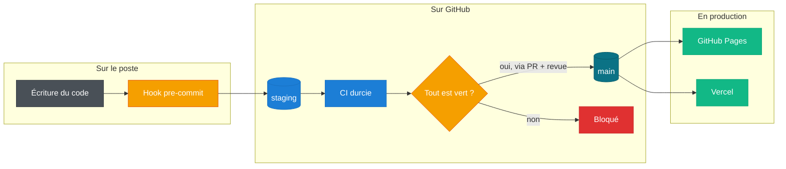

Chaque étage ci-dessus est une **garantie** ajoutée. On détaille maintenant chaque thème selon la
même démarche : le besoin auquel il répond, ce qu'on a vu en cours et les bonnes pratiques associées,
les contraintes précises de l'énoncé, ce qu'on a concrètement mis en place, et enfin les points à ne
pas oublier.

## 1. La gouvernance des branches

{ .logo-md }

**Notre démarche :**

- **Prise en compte du besoin :** dans une équipe, plusieurs personnes touchent au même code en même
  temps. Sans règles, n'importe qui pourrait envoyer directement en production une modification non
  testée, ou écraser le travail d'un autre. On voulait donc une organisation où la production reste
  intouchable et où toute l'équipe se synchronise sur une base commune, sans conflit ni mauvaise
  surprise.
- **Vu en cours et bonnes pratiques :** on a vu qu'un dépôt sérieux repose sur un flux de branches
  clair, souvent une variante allégée du Git Flow : une branche d'**intégration** où tout converge, et
  une branche de **production verrouillée**. La bonne pratique clé, c'est que rien n'atteint la branche
  de production sans passer par une **Pull Request relue par un pair**. La revue de code joue le rôle
  de garde-fou humain, en complément des contrôles automatiques.
- **Contraintes de l'énoncé :** le workflow doit se déclencher sur `staging` **et** `main`, les jobs de
  déploiement portent un `if` sur `main`, une matrice `needs` stricte les enchaîne, et le job de
  production est rattaché à un `environment` nommé.
- **Ce qu'on met en place :** on a défini `staging` comme branche par défaut (pour que tout parte
  d'elle), protégé `main` avec un ruleset GitHub qui exige une revue avant fusion, et rendu la
  politique lisible directement dans le YAML.
- **À ne pas oublier :** le push direct sur `main` est **interdit** (pas seulement déconseillé), la
  politique doit être **visible dans le YAML** lui-même, et le job de prod porte un `environment` nommé.

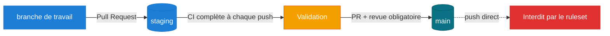

## 2. Le durcissement local (Shift-Left)

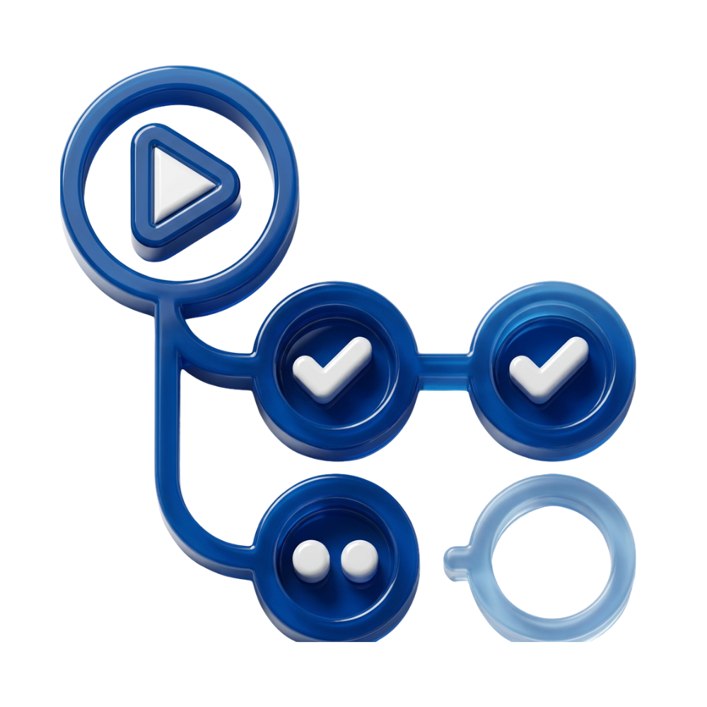{ .logo-md }

**Notre démarche :**

- **Prise en compte du besoin :** plus une erreur est détectée tôt, moins elle coûte cher. Un secret
  oublié ou un workflow invalide qui atteint GitHub, c'est déjà une trace publique et du temps perdu.
  On voulait donc un premier filet **sur le poste du développeur**, avant même le premier `push`.
- **Vu en cours et bonnes pratiques :** c'est exactement le principe du **Shift-Left**, qu'on a étudié
  en cours : « décaler vers la gauche » les contrôles de sécurité, c'est-à-dire les rapprocher du
  moment où le code est écrit. L'outil standard pour ça est le **hook Git `pre-commit`**, un script qui
  s'exécute automatiquement avant chaque commit et peut le refuser.
- **Contraintes de l'énoncé :** le hook doit valider séquentiellement `actionlint` sur les workflows
  puis `gitleaks` **sur les fichiers indexés uniquement**, refuser tout `.env` / `.pem` / `.key` avec
  un message rouge, et s'appuyer sur une règle Gitleaks sur-mesure pour les jetons `SECWALLET_`.
- **Ce qu'on met en place :** un hook **versionné** (donc auditable et réinstallable par toute
  l'équipe), construit comme trois barrières bloquantes successives, et une règle
  `SECWALLET_[A-Z0-9]{24}` couplée à une vérification d'entropie.
- **À ne pas oublier :** le message rouge est imposé **au mot près**, gitleaks ne scanne que le
  **staged**, la règle veut **exactement 24 caractères**, et le hook doit **réellement bloquer** le
  commit (code de sortie non nul), pas seulement afficher un avertissement.

## 3. Les secrets par enveloppe

{ .logo-md }

**Notre démarche :**

- **Prise en compte du besoin :** une API qui manipule des données sensibles a besoin de secrets
  (URL de base de données, clé JWT, clés d'API). Le réflexe naïf serait de les mettre dans un fichier
  `.env`, mais alors ils fuiraient dans l'historique Git. On voulait pouvoir **versionner** ces
  secrets sans jamais les exposer en clair, tout en gardant un fichier qu'un Ops peut relire.
- **Vu en cours et bonnes pratiques :** la réponse, c'est le **chiffrement par enveloppe** dans une
  logique **GitOps**. On a vu que l'idée est de stocker les secrets **chiffrés** dans le dépôt, et de
  ne les déchiffrer qu'au dernier moment, au runtime. On utilise **age** (un outil de chiffrement
  moderne et simple) pour la paire de clés, et **SOPS** pour chiffrer intelligemment le fichier.
- **Contraintes de l'énoncé :** la clé privée doit s'appeler `ops.txt`, SOPS ne doit chiffrer **que
  les valeurs** (les clés YAML restent lisibles pour des `git diff` propres), et le déchiffrement en
  CD doit se faire **en RAM**, sans jamais écrire de secret sur le disque du runner.
- **Ce qu'on met en place :** une paire `age`, un `encrypted_regex` qui cible uniquement les valeurs
  à chiffrer, et au déploiement la clé `SOPS_AGE_KEY` lue directement depuis une variable
  d'environnement, donc en mémoire.
- **À ne pas oublier :** `ops.txt` reste **hors du dépôt**, **seules les valeurs** sont chiffrées, et
  **aucun fichier de secret en clair** ne doit toucher le disque du runner (donc surtout pas de
  `mktemp`).

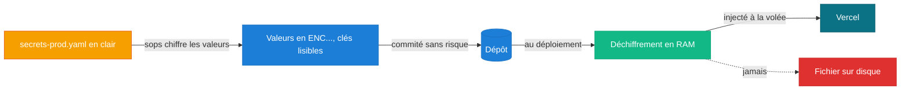

## 4. La conteneurisation et GHCR

{ .logo-md }

**Notre démarche :**

- **Prise en compte du besoin :** pour livrer le backend de façon fiable, il faut qu'il tourne partout
  pareil, quelle que soit la machine. On voulait donc un artefact reproductible (une image Docker),
  tout en évitant de le reconstruire à chaque fois qu'on modifie une virgule du frontend.
- **Vu en cours et bonnes pratiques :** on a vu plusieurs bonnes pratiques d'image Docker : le
  **multi-stage build** (on compile / installe dans un premier étage, et on ne garde que le strict
  nécessaire dans l'image finale, plus légère et avec moins de surface d'attaque), l'exécution en
  **non-root**, le **scan de vulnérabilités avant publication**, et l'usage d'un **tag immuable** (le
  SHA du commit) plutôt que `latest`, qui change tout le temps.
- **Contraintes de l'énoncé :** image multi-stage, build **conditionné au filtrage de chemins**, scan
  Trivy de l'image **avant** toute publication, et push sur GHCR seulement si le scan est clean, avec
  l'image taggée au SHA du commit.
- **Ce qu'on met en place :** un `Dockerfile` à deux étages (`deps` puis `runtime`), un utilisateur
  dédié `nodeapp`, un filtre `dorny/paths-filter`, un `trivy image` bloquant, et un push conditionnel.
- **À ne pas oublier :** multi-stage **et** non-root, rebuild **seulement si** le backend change, scan
  **avant** le push, et tag **= SHA** du commit (pas `latest`).

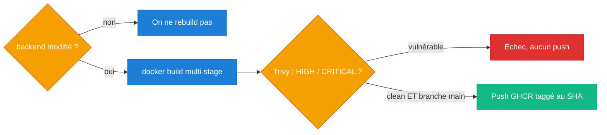

## 5. La CI durcie, une vraie barrière

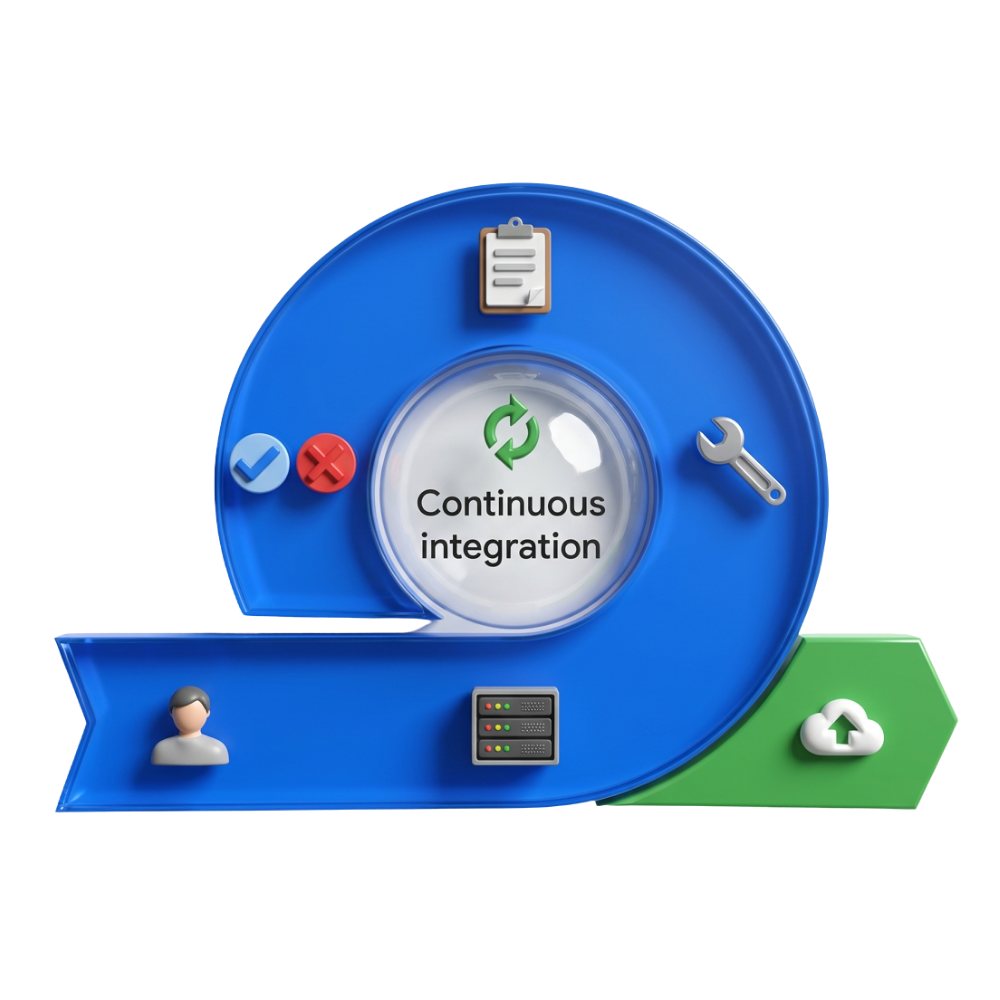{ .logo-md }

**Notre démarche :**

- **Prise en compte du besoin :** une chaîne CI/CD n'a de valeur que si elle est **infranchissable**.
  Si un développeur peut contourner un test qui échoue, la barrière ne sert plus à rien. On voulait un
  pipeline strict, où un seul contrôle en échec bloque tout le reste.
- **Vu en cours et bonnes pratiques :** on a appliqué plusieurs principes vus en cours. Le **moindre
  privilège** : par défaut, un job ne doit avoir que les droits strictement nécessaires. L'**analyse
  statique de sécurité (SAST)** avec CodeQL, qui lit le code sans l'exécuter pour repérer des failles.
  Le **fail-fast** : on arrête dès qu'un problème apparaît. Et l'interdiction de tout **contournement**
  (le fameux `continue-on-error`).
- **Contraintes de l'énoncé :** `permissions: contents: read` au niveau global, cache des dépendances
  Node, CodeQL avec téléversement du SARIF et échec sur `High`/`Error`, tests et Gitleaks bloquants,
  `continue-on-error` interdit, et déploiements dépendants de tous ces contrôles.
- **Ce qu'on met en place :** des permissions globales en lecture seule (les écritures comme
  `packages: write` sont ouvertes uniquement dans le job concerné), un contrôle `jq` sur le rapport
  SARIF qui fait échouer le job en cas de faille majeure, et un graphe `needs` strict.
- **À ne pas oublier :** `contents: read` **global**, écritures **isolées** par job,
  `continue-on-error` **interdit**, CodeQL doit **faire échouer** sur une faille majeure, et le
  **SARIF est téléversé**.

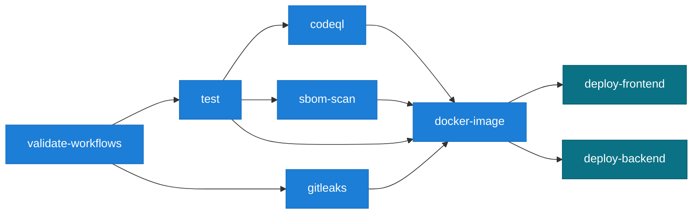

## 6. La composite action

{ .logo-md }

**Notre démarche :**

- **Prise en compte du besoin :** le scan de dépendances (via un SBOM) est le genre d'étape qu'on
  pourrait vouloir réutiliser à plusieurs endroits. Copier-coller la même suite de commandes serait
  fragile et difficile à maintenir. On voulait donc un composant unique, autonome et réutilisable.
- **Vu en cours et bonnes pratiques :** deux idées se rejoignent ici. Le principe **DRY** (« Don't
  Repeat Yourself »), qui pousse à factoriser la logique répétée. Et la notion de **boîte noire** :
  une action doit masquer sa complexité derrière des **entrées** et **sorties** claires, pour que
  celui qui l'utilise n'ait pas à savoir comment elle fonctionne à l'intérieur.
- **Contraintes de l'énoncé :** l'action doit être de type `composite`, accepter une **entrée
  obligatoire** (le chemin du SBOM au format CycloneDX), échouer **uniquement** sur des vulnérabilités
  `CRITICAL`, et se contenter d'un **avertissement** dans le résumé pour les `HIGH` et `MEDIUM`.
- **Ce qu'on met en place :** un `action.yml` composite, une entrée requise, l'installation de Trivy
  intégrée à l'action (pour qu'elle soit vraiment autonome), et deux niveaux de sévérité distincts.
- **À ne pas oublier :** type **composite** avec entrée **obligatoire**, échec **seulement sur
  CRITICAL**, `HIGH`/`MEDIUM` en simple **avertissement**, et l'action **installe Trivy elle-même**
  pour rester une boîte noire portable.

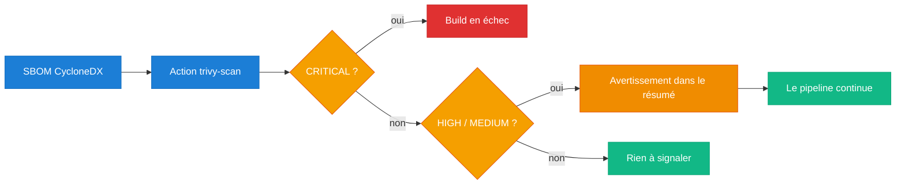

## 7. Le déploiement continu

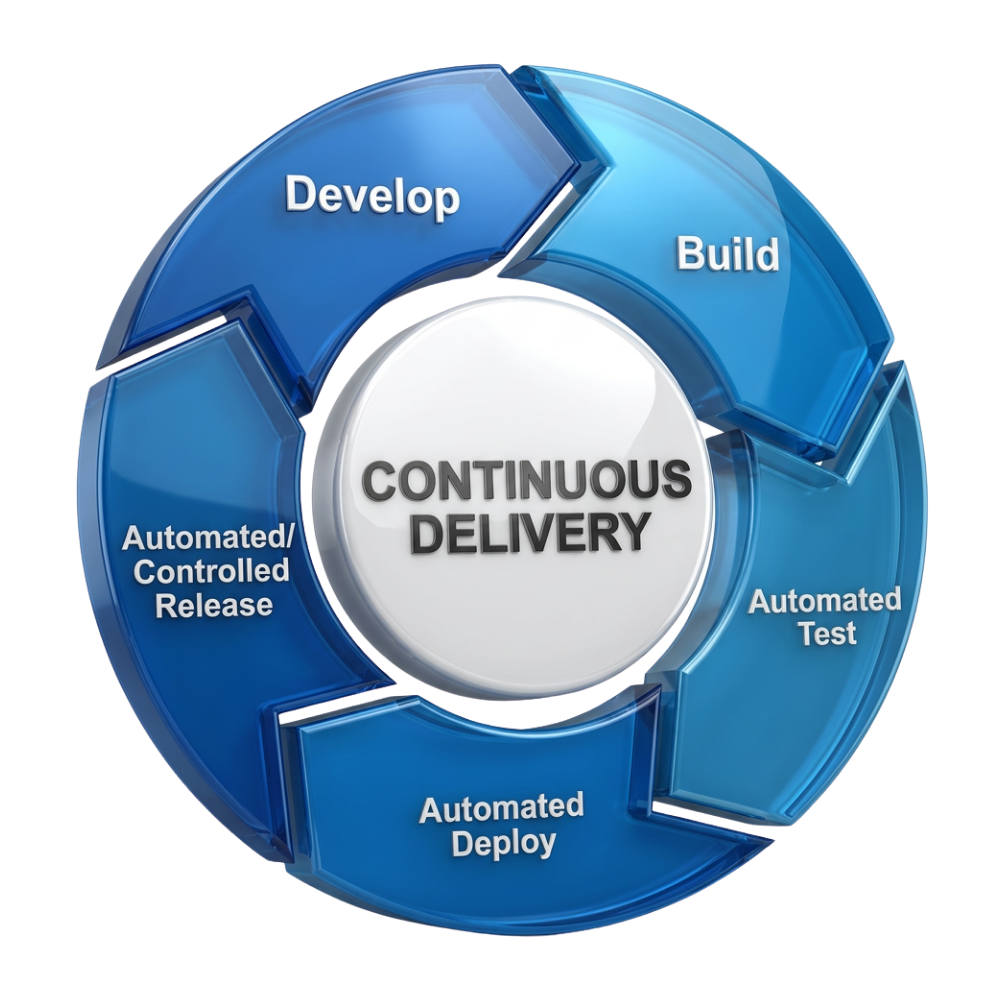{ .logo-md }

**Notre démarche :**

- **Prise en compte du besoin :** une fois la CI verte, on veut que la mise en production soit
  **automatique** et sans intervention manuelle, mais uniquement pour du code validé, et sans jamais
  laisser traîner un secret au passage.
- **Vu en cours et bonnes pratiques :** on a découvert l'**OIDC** (OpenID Connect), qui permet à
  GitHub d'obtenir une **identité temporaire** auprès du service cible, sans stocker de secret longue
  durée : c'est plus sûr qu'un token permanent. On a aussi vu le déploiement **hermétique** (via un
  artefact éphémère, sans polluer l'historique Git) et l'injection des secrets **à la volée** dans la
  commande de déploiement.
- **Contraintes de l'énoncé :** déploiement **sur `main` uniquement** et seulement si toute la CI est
  verte, frontend publié sur GitHub Pages en **OIDC** (`pages: write` + `id-token: write`), et backend
  déployé sur Vercel avec les secrets déchiffrés en RAM.
- **Ce qu'on met en place :** deux jobs conditionnés à `main` et dépendants de tous les contrôles,
  `upload-pages-artifact` + `deploy-pages` pour le frontend, et `vercel deploy` avec les variables
  passées en `--env` pour le backend.
- **À ne pas oublier :** déploiement sur `main` **uniquement** et CI **verte**, **OIDC** (`pages` +
  `id-token`), et secrets **injectés à la volée** sans jamais rien écrire sur le disque.

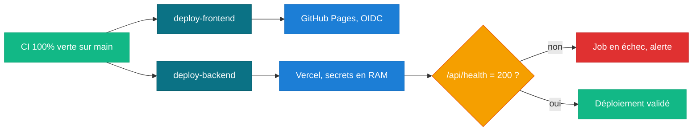

## 8. La robustesse

**Notre démarche :**

- **Prise en compte du besoin :** deux risques concrets restaient à couvrir. D'abord, gaspiller des
  ressources (et créer des conflits de déploiement) quand plusieurs commits arrivent coup sur coup.
  Ensuite, déployer une version cassée sans s'en rendre compte.
- **Vu en cours et bonnes pratiques :** on a vu l'**annulation de concurrence**, qui stoppe
  automatiquement les exécutions devenues inutiles, et le **healthcheck** (ou smoke test) juste après
  le déploiement, une petite requête qui confirme que l'application répond vraiment.
- **Contraintes de l'énoncé :** si deux commits sont poussés coup sur coup, le pipeline du premier
  doit **s'annuler immédiatement**, et une requête `curl` vers `/api/health` doit **faire échouer** le
  job si la réponse n'est pas `200`.
- **Ce qu'on met en place :** un bloc `concurrency` avec `cancel-in-progress`, et un `curl --fail` sur
  l'URL de production générée dynamiquement par Vercel.
- **À ne pas oublier :** annulation **immédiate** du run périmé, healthcheck sur l'**URL dynamique**,
  et tout code de réponse **différent de 200** fait **échouer** le job.

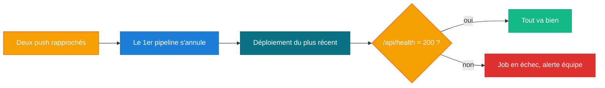

Chaque exigence est reprise, **avec sa preuve** (extrait de code, configuration, déploiement en
ligne), sur la page [Conformité](conformite.md). Le détail technique complet se trouve dans la section
[Implémentation](architecture.md).
