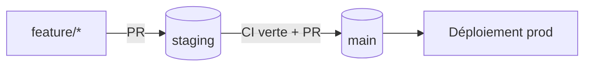

# Gouvernance Git

{ .logo }

La politique de sécurité est **lisible directement dans le YAML** : à la simple lecture du workflow,
un auditeur constate qu'un déploiement sur `main` exige le succès absolu des jobs amont.

## Modèle de branches

| Branche | Rôle | Règles |
|---------|------|--------|
| `staging` | Branche **pivot** d'intégration (par défaut) | La CI s'exécute **entièrement** à chaque push et pull request |
| `main` | État **stable en production** | Push directs **interdits** · **revue** + status checks requis (ruleset) · `environment: production` |

!!! warning "`main` réellement protégée"
    La protection est **effective** (ruleset GitHub) : toute PR vers `main` est en état `REVIEW_REQUIRED`
    et ne peut être fusionnée sans revue. La politique cible est aussi documentée dans
    [`.github/branch-protection/main.yml`](https://github.com/Sorway/DevSecOps/blob/main/.github/branch-protection/main.yml).

## Visibilité dans le workflow

```yaml
on:
  push:
    branches: [staging, main]        # déclenché sur les deux branches
  pull_request:
    branches: [staging, main]

jobs:
  deploy-backend:
    if: github.ref == 'refs/heads/main'                       # (1) bloc conditionnel de niveau job
    needs: [test, gitleaks, codeql, sbom-scan, docker-image]  # (2) matrice de dépendance stricte
    environment: production                                   # (3) environnement GitHub nommé
```

1. **Conditionnel de job** : les déploiements ne s'exécutent que sur `main`.
2. **`needs` strict** : ils dépendent du succès de *tous* les contrôles de sécurité et de livraison.
3. **`environment`** nommé : gate de production explicite.

## Stratégie de promotion



Le code des développeurs fusionne dans `staging` ; `main` ne reçoit que du code **promu** depuis
`staging`, après revue et succès complet de la CI.
