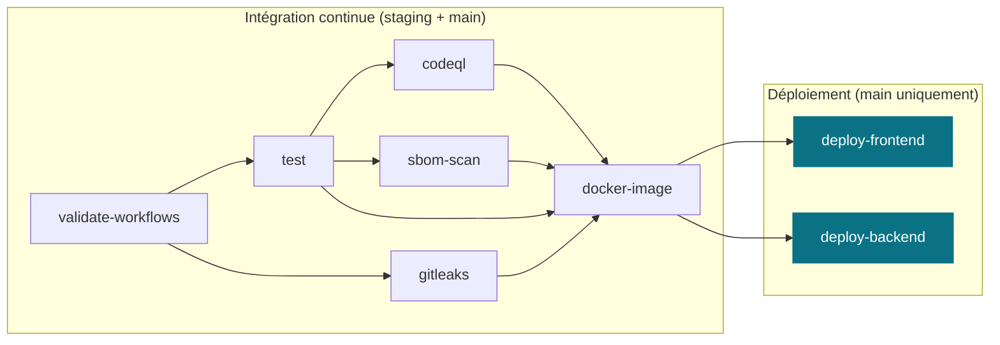

# SecureWallet

**Chaîne de livraison auditable, hermétique et infalsifiable** pour une SPA statique et une API
Node.js manipulant des données sensibles, industrialisées en un pipeline durci où *aucun code
n'atteint la production sans validation technique*.

!!! note "Projet final — DevSecOps avancé (Sophia Ynov Campus)"
    Une équipe de développement nous confie le dépôt d'une application : une SPA statique
    (`frontend/`) et une API Node.js / Express (`backend/`) manipulant des données hautement
    sensibles (clés d'API, accès à des infrastructures externes). **Notre mission :
    industrialiser, durcir et sécuriser toute la chaîne CI/CD** — gouvernance Git, secrets
    chiffrés de bout en bout, conteneurisation, analyse statique, déploiement continu.

[:material-web: Frontend (GitHub Pages)](https://sorway.github.io/DevSecOps/){ .md-button .md-button--primary }
[:material-server: API (Vercel)](https://projet-final-inky-iota.vercel.app){ .md-button }
[:material-github: Dépôt](https://github.com/Sorway/DevSecOps){ .md-button }

{ height="32" }
{ height="32" }
{ height="32" }
{ height="32" }
{ height="32" }
{ height="32" }
{ height="32" }
{ height="32" }
{ height="32" }

## Les deux composants

| Composant | Description | Livraison |
|-----------|-------------|-----------|
| `frontend/` | Single Page Application 100 % statique (HTML / CSS / JS moderne) consommant l'API | **GitHub Pages** via OIDC |
| `backend/` | API REST Node.js / Express manipulant des données sensibles | **Docker → GHCR** + **Vercel** |

## Le pipeline en un coup d'œil

À la simple lecture de [`ci-cd.yml`](https://github.com/Sorway/DevSecOps/blob/main/.github/workflows/ci-cd.yml),
un auditeur constate qu'un déploiement sur `main` **exige le succès absolu** des jobs de validation amont.

## Points clés

- :material-source-branch: **Gouvernance** : `staging` pivot d'intégration, `main` protégée (revue + status checks, push direct interdit).
- :material-shield-check: **Shift-Left** : hook `pre-commit` (actionlint + gitleaks + refus des `.env`/`.pem`/`.key`).
- :material-lock: **Secrets** : chiffrement par enveloppe SOPS + age, déchiffrés en RAM, jamais sur disque.
- :material-docker: **Conteneur** : Dockerfile multi-stage non-root, scan Trivy, publication conditionnelle sur GHCR taggée au SHA.
- :material-magnify-scan: **CI hermétique** : moindre privilège, cache npm, CodeQL (SARIF), barrière stricte sans `continue-on-error`.
- :material-rocket-launch: **CD** : GitHub Pages (OIDC) + Vercel (secrets injectés à la volée), healthcheck post-déploiement.

!!! tip "Par où commencer"
    Lisez d'abord le [Contexte & consignes](contexte.md), puis suivez la navigation dans l'ordre.
    La page [Conformité aux consignes](conformite.md) récapitule, point par point, la couverture de l'énoncé.
