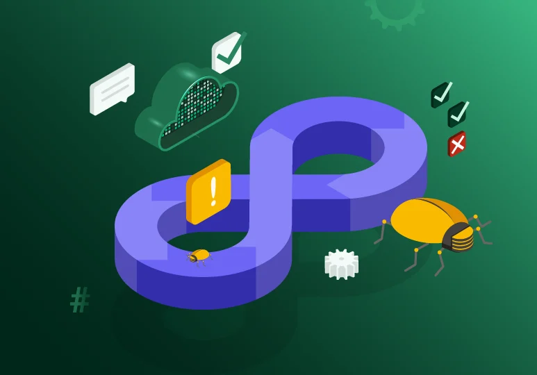
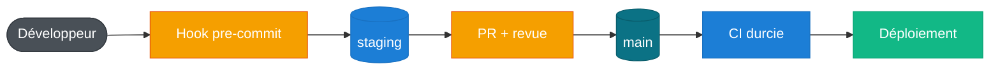

# SecureWallet, une chaîne de livraison sécurisée ! ♾️

  <picture>
    <source media="(prefers-color-scheme: dark)" srcset="assets/logo_ynov_campus_sophia_white.png">
    
  </picture>
  

{ .hero }

## Projet final DevSecOps · M1 Cloud, Sécurité & Infrastructure { .section-bar }

---

**SecureWallet** industrialise une SPA statique et une API **Node.js** { .inline-logo } / Express en une **chaîne CI/CD durcie**, auditable et infalsifiable. L'image backend **Docker** { .inline-logo } (multi-stage, non-root) est scannée par **Trivy** { .inline-logo } puis publiée sur **GHCR**. Le code passe au crible de **CodeQL** { .inline-logo }, les secrets sont traqués par **Gitleaks** { .inline-logo } et chiffrés par enveloppe avec **SOPS** { .inline-logo } + age.

Le tout est orchestré par **GitHub Actions** { .inline-logo } et déployé sur **GitHub Pages** { .inline-logo } (frontend, via OIDC) et **Vercel** { .inline-logo } (backend). Ce projet conclut un bloc de formation d'environ **28 h** de DevSecOps à Sophia Ynov Campus, en filière Cloud, Sécurité & Infrastructure.

[:material-web: Frontend](https://sorway.github.io/DevSecOps/){ .md-button .md-button--primary }
[:material-server: API](https://projet-final-inky-iota.vercel.app){ .md-button }
[:material-github: Dépôt](https://github.com/Sorway/DevSecOps){ .md-button }

## L'Équipe sur ce lab { .section-bar }

  

    
    <strong>Thibaut Gianola</strong>
    <a class="handle" href="https://github.com/astronas">@astronas</a>
  

  

    
    <strong>Jonathan Panzer</strong>
    <a class="handle" href="https://github.com/Sorway">@Sorway</a>
  

  

    
    <strong>Redouane Kachour</strong>
    <a class="handle" href="https://github.com/Tiwen2">@tiwen2</a>
  

## De quoi s'agit-il ?

Quand une entreprise met en ligne une application qui manipule des données sensibles (comptes, clés
d'accès, informations personnelles), le vrai danger n'est pas seulement dans le code lui-même : il
est dans **tout ce qui l'entoure**. Qui a le droit de modifier quoi ? Un mot de passe oublié dans un
fichier, une faille glissée sans le vouloir, une image serveur vulnérable... comment les repère-t-on
**avant** qu'ils n'arrivent chez les utilisateurs ?

Ce projet construit cette **chaîne de sécurité automatisée** autour d'une petite application web. À
chaque modification du code, une série de contrôles se lance toute seule : recherche de secrets
oubliés, analyse du code à la recherche de failles, scan des vulnérabilités, tests automatiques. Tant
que tout n'est pas au vert, rien n'est mis en ligne, et chaque action reste tracée et vérifiable.

Cette documentation raconte, étape par étape, **comment** on l'a construite. Elle s'adresse à trois
publics :

- au **correcteur**, pour vérifier point par point que le cahier des charges est respecté ;
- à un **recruteur ou un développeur curieux**, pour voir concrètement à quoi ressemble un pipeline
  DevSecOps industriel de bout en bout ;
- à **nous**, l'équipe, comme mémoire technique du projet.

## En bref

Deux composants, une seule chaîne CI/CD durcie. Le code des développeurs passe par une branche
d'intégration, la production n'accepte que du code techniquement validé, et chaque secret reste
chiffré de bout en bout.

| Composant | Rôle | Livraison |
|-----------|------|-----------|
| `frontend/` | SPA statique (HTML / CSS / JS moderne) qui consomme l'API | GitHub Pages (OIDC) |
| `backend/` | API REST Node.js / Express, données sensibles | Docker → GHCR + Vercel |

## Comment lire cette documentation

1. **[Contexte & consignes](contexte.md)** : ce qu'on nous demande, et comment on s'y prend.
2. **[Implémentation](architecture.md)** : le détail technique, section par section.
3. **[Conformité](conformite.md)** : la couverture de l'énoncé, exigence par exigence.
