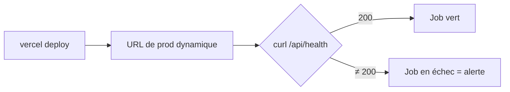

# Robustesse & rollback

Deux mécanismes valident la résilience industrielle de l'infrastructure.

## Gestion de la concurrence

Si un développeur pousse **deux commits coup sur coup**, le pipeline du premier s'annule
immédiatement, pour économiser les ressources et éviter la concurrence lors des déploiements.

```yaml
concurrency:
  group: ci-cd-${{ github.ref }}
  cancel-in-progress: true
```

!!! note "Sérialisation du déploiement Pages"
    Le job `deploy-frontend` a en plus sa propre concurrence (`cancel-in-progress: false`) pour
    **ne pas interrompre** un déploiement Pages en cours, tout en n'en lançant qu'un à la fois.

## Healthcheck post-déploiement

Une fois Vercel terminé, l'URL de production générée dynamiquement est sondée. Si l'API ne renvoie
pas `200 OK`, le job **échoue**, notifiant immédiatement l'équipe d'une anomalie.

```yaml
- name: Healthcheck
  run: curl --fail --silent --show-error "${{ steps.vercel.outputs.url }}/api/health"
```



- `curl --fail` renvoie un code non nul sur tout statut HTTP ≥ 400 → le job GitHub Actions échoue.
- Le healthcheck valide en bout de chaîne que les **secrets de production** ont bien été injectés et
  que l'API répond réellement.
